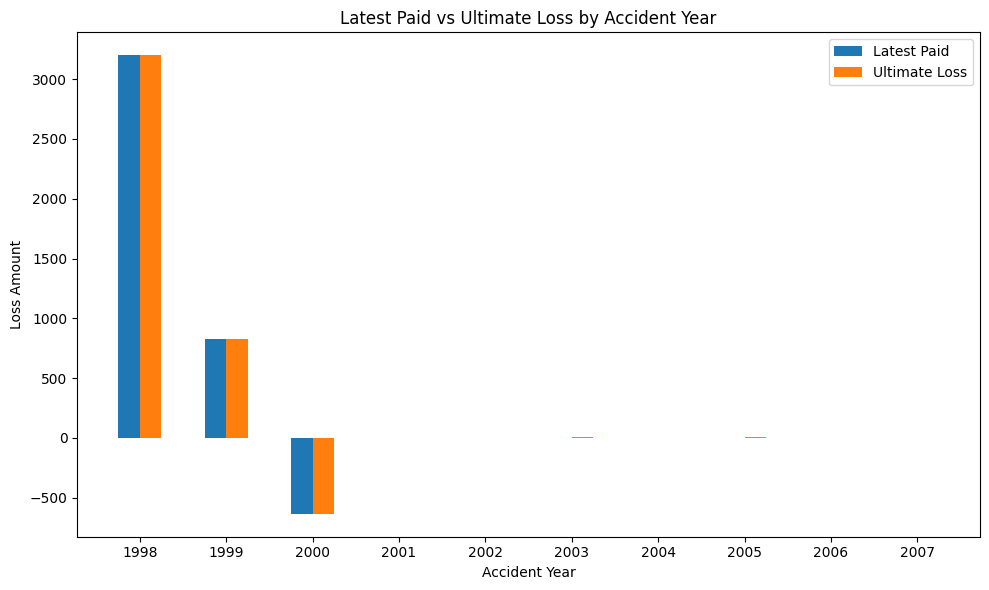
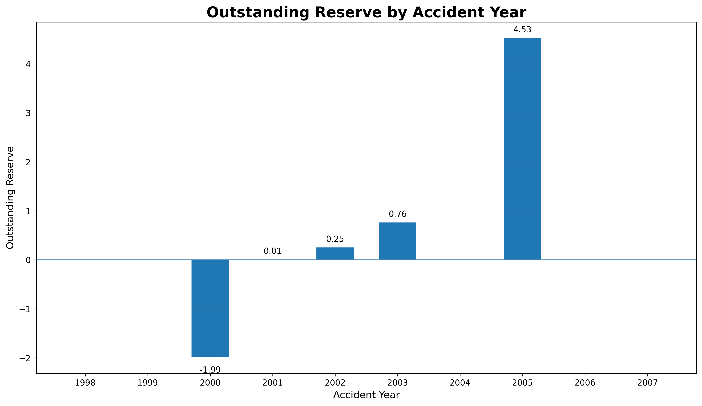
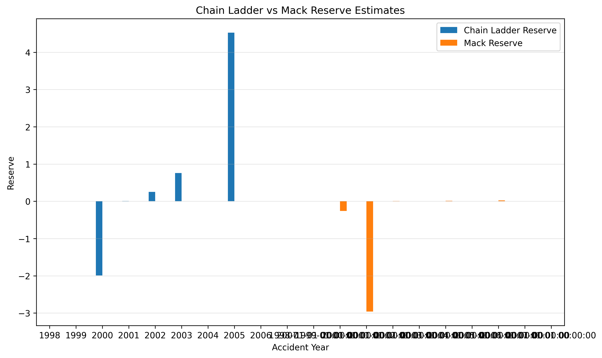

# Actuarial Claims Reserving Workflow Using Python

## Executive Summary

This project presents an end-to-end actuarial claims reserving workflow developed in Python, demonstrating the practical application of both deterministic and stochastic reserving techniques.

Using the **Chain Ladder** and **Mack Chain Ladder** methodologies, the analysis estimates outstanding insurance claim liabilities, evaluates reserve uncertainty and illustrates how actuarial analytics supports financial reporting, capital management and risk governance within general insurance.

Designed to reflect a real-world actuarial engagement, the project combines data preparation, actuarial modelling, validation and business interpretation into a transparent and reproducible analytical workflow.


## Business Problem

Insurance companies must estimate the value of claims that have already occurred but have not yet been fully settled. These estimates, known as **claims reserves**, are essential for maintaining financial stability, meeting regulatory requirements and ensuring that policyholder obligations can be met.

Underestimating reserves may expose an insurer to solvency risk, while overestimating reserves can reduce profitability and distort financial performance. Reliable reserving therefore plays a central role in actuarial practice, financial reporting and strategic decision-making.

This project demonstrates how actuarial techniques can be applied using Python to estimate outstanding claim liabilities while providing transparent, evidence-based insights for business decision-makers.

## Business Questions

This project addresses several key actuarial and business questions:

- What is the estimated value of outstanding insurance claim liabilities?
- Which accident years contribute most significantly to reserve risk?
- How reliable are the reserve estimates produced by deterministic methods?
- How does the Mack Chain Ladder method improve reserve assessment by quantifying uncertainty?
- What insights can support actuarial judgement and reserving decisions?

## Business Objectives

This project aims to support actuarial reserving decisions by:

- Estimating outstanding insurance claim liabilities.
- Assessing historical claims development patterns.
- Constructing cumulative paid loss triangles.
- Calculating development factors.
- Estimating ultimate losses.
- Quantifying reserve uncertainty using the Mack Chain Ladder method.
- Producing a transparent and reproducible actuarial reserving workflow.

## Dataset

The analysis uses a historical general insurance claims development dataset representing multiple accident years and development periods.

The dataset includes key actuarial variables required for constructing cumulative loss triangles and estimating outstanding claim liabilities, including:

- Insurance Group Code
- Insurance Group Name
- Accident Year
- Development Year
- Development Lag
- Incurred Losses
- Cumulative Paid Losses
- Bulk Losses
- Earned Premium
- Posted Reserves

For this analysis, the workflow focuses on the **Allstate Insurance Group** portfolio to demonstrate practical actuarial reserving techniques within a realistic insurance setting.

## Analytical Methodology

The project follows a structured actuarial reserving workflow that mirrors the analytical process commonly adopted within general insurance organisations.

```text
                 HISTORICAL CLAIMS DATA
                          │
                          ▼
              Data Audit & Validation
                          │
                          ▼
              Portfolio Familiarisation
                          │
                          ▼
         Construction of Paid Loss Triangle
                          │
                          ▼
         Age-to-Age Development Factors
                          │
                          ▼
        Selection of Development Factors
                          │
                          ▼
     Cumulative Development Factors (CDFs)
                          │
                          ▼
          Ultimate Loss Estimation
                          │
                          ▼
     Outstanding Reserve Estimation
                          │
                          ▼
   Mack Chain Ladder Uncertainty Analysis
                          │
                          ▼
      Reserve Comparison & Validation
                          │
                          ▼
 Business Interpretation & Actuarial Report
```

### Workflow Stages

| Stage | Purpose |
|-------|---------|
| **Data Audit & Validation** | Verify data quality, completeness and consistency before analysis. |
| **Portfolio Familiarisation** | Understand the insurance portfolio and identify the subset for analysis. |
| **Loss Triangle Construction** | Organise cumulative paid claims into a development triangle. |
| **Development Factors** | Calculate age-to-age development factors to model claims progression. |
| **CDF Calculation** | Estimate cumulative development factors used to project ultimate losses. |
| **Ultimate Loss Estimation** | Estimate the total expected cost of claims for each accident year. |
| **Reserve Estimation** | Calculate outstanding claims reserves by comparing ultimate losses with paid losses. |
| **Mack Chain Ladder Analysis** | Quantify reserve uncertainty using stochastic reserving techniques. |
| **Business Interpretation** | Translate analytical outputs into insights that support actuarial judgement and business decision-making. |

## Actuarial Methods

### Deterministic Reserving

- Chain Ladder Method

### Stochastic Reserving

- Mack Chain Ladder Method

## Technologies Used

- Python
- Pandas
- NumPy
- Matplotlib
- Chainladder (Python Library)
- Jupyter Notebook

## Repository Structure

```text
Actuarial-Claims-Reserving-Workflow/
│
├── data/
├── notebooks/
├── reports/
├── visualizations/
├── README.md
└── requirements.txt
```

## Key Results

The analysis produced the following key actuarial outputs that support reserve estimation and evidence-based decision-making.

| Analytical Output | Business Purpose |
|-------------------|------------------|
| **Cumulative Paid Loss Triangle** | Forms the foundation for analysing historical claims development patterns. |
| **Age-to-Age Development Factors** | Measure how claims mature over time and provide the basis for reserve projections. |
| **Selected Development Factors** | Represent actuarial judgement in selecting appropriate development assumptions. |
| **Cumulative Development Factors (CDFs)** | Project reported claims to their expected ultimate values. |
| **Estimated Ultimate Losses** | Estimate the total expected cost of claims for each accident year. |
| **Outstanding Claims Reserves** | Quantify future claim payment obligations and support financial reporting. |
| **Mack Chain Ladder Reserve Estimates** | Produce stochastic reserve estimates while accounting for uncertainty. |
| **Mack Standard Errors** | Measure the variability and reliability of reserve estimates. |
| **Reserve Comparison** | Compare deterministic and stochastic approaches to strengthen actuarial judgement. |

> **Note:** All analytical outputs and visualisations generated during the project are available in the `visualizations/` directory.

## Business Impact

Effective claims reserving is fundamental to the financial health and long-term sustainability of insurance companies. Accurate reserve estimates support regulatory compliance, strengthen financial reporting and enable insurers to make informed strategic decisions.

This project demonstrates how actuarial analytics can transform historical claims data into practical business intelligence by combining traditional reserving methodologies with modern data analytics techniques.

### Business Value Delivered

The workflow developed in this project enables insurers to:

- Improve the accuracy of outstanding claims reserve estimates.
- Support financial reporting and regulatory compliance requirements.
- Strengthen capital planning and solvency assessment.
- Quantify reserve uncertainty to support actuarial judgement.
- Increase transparency through a structured and reproducible reserving process.
- Enhance risk management by identifying accident years with higher reserve uncertainty.
- Provide evidence-based insights that support pricing, portfolio management and strategic planning.

Ultimately, this project demonstrates that actuarial analytics is not simply about estimating reserves—it is about enabling better financial decisions through robust analysis, transparency and informed professional judgement.

## Key Visualisations

The following visualisations summarise the main analytical outputs produced during the reserving workflow and illustrate how actuarial modelling supports reserve estimation and business decision-making.

### 1. Latest Paid vs Ultimate Loss by Accident Year



**Insight**

This comparison highlights the difference between observed cumulative paid claims and estimated ultimate losses for each accident year. The projected ultimate losses provide the basis for calculating outstanding claims reserves.

---

### 2. Outstanding Reserve by Accident Year



**Insight**

This visual identifies accident years requiring the largest outstanding reserve estimates, supporting actuarial judgement and reserve adequacy assessment.

---

### 3. Chain Ladder vs Mack Reserve Estimates



**Insight**

This comparison demonstrates how deterministic and stochastic reserving techniques can produce different reserve estimates. The Mack Chain Ladder method additionally quantifies reserve uncertainty, supporting more informed actuarial decision-making.

## Model Assumptions

The Chain Ladder methodology relies on several important assumptions:

- Historical claims development patterns are representative of future claim development.
- Claims are reported and settled consistently over time.
- There are no material changes in claims handling practices, underwriting strategy, legislation, inflation, or the operating environment.
- Development factors remain reasonably stable across accident years.
- Past claims development provides a reliable basis for projecting future development.

## Model Limitations

Although widely used in actuarial practice, the Chain Ladder methodology has several limitations:

- Sensitive to unusual claims experience and large outliers.
- Assumes homogeneous development across accident years.
- Performance deteriorates when historical development patterns change.
- Does not explicitly model inflation or operational changes.
- Requires sufficient historical development data.

The Mack Chain Ladder extends the deterministic approach by providing reserve uncertainty estimates but still relies on the same underlying development assumptions.

## Skills Demonstrated

### Actuarial Skills

- Insurance Claims Reserving
- Chain Ladder Reserving
- Mack Chain Ladder
- Loss Development Triangle Analysis
- Development Factor Selection
- Reserve Estimation
- Reserve Uncertainty Analysis

### Technical Skills

- Python Programming
- Data Cleaning
- Data Validation
- Exploratory Data Analysis
- Statistical Analysis
- Data Visualisation
- Actuarial Reporting
- Reproducible Analytical Workflows

## Future Improvements

Potential extensions include:

- Bornhuetter–Ferguson Reserving
- Bootstrap Chain Ladder
- Generalised Linear Models (GLMs)
- Bayesian Reserving Techniques
- Interactive dashboards using Power BI or Streamlit

## Conclusion

This project demonstrates how actuarial analytics can transform historical insurance claims data into meaningful reserve estimates that support financial reporting, capital management and strategic decision-making.

By combining deterministic and stochastic reserving methodologies within a transparent Python workflow, the analysis reflects the technical rigour, analytical thinking and business communication expected of modern actuarial professionals.

Beyond demonstrating the implementation of the Chain Ladder and Mack Chain Ladder methods, this project illustrates how actuarial science creates value by enabling organisations to make informed, evidence-based decisions under uncertainty.

## Author

# Anthony Utulu

**Actuarial & Business Analytics Professional**

*Transforming Data into Better Decisions*

📧 **Email:** utulu.an@gmail.com

💼 **LinkedIn:** https://www.linkedin.com/in/utulu-an

🌐 **GitHub:** https://github.com/Utulu1
